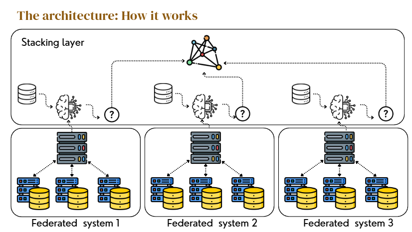

# Comparative Analysis of Distributed Learning Architectures

### Centralized, Federated, and Ensemble Federated Learning

## Abstract

This repository presents a systematic comparison of three machine learning paradigms—**Centralized Ensemble Learning**, **Traditional Federated Learning (FedAvg)**, and a **Hierarchical Federated Ensemble Learning (HFEL)** architecture—applied to the *Breast Cancer Wisconsin* dataset.

The study investigates the trade-offs between **predictive accuracy**, **data privacy**, **robustness to Non-IID data**, and **security** in the context of **medical diagnostic systems**, where centralized data aggregation is often infeasible due to regulatory and ethical constraints.

---

## 1. Problem Motivation

Healthcare data is inherently:

* **Sensitive** (patient confidentiality)
* **Distributed** (across hospitals and clinics)
* **Heterogeneous** (population, acquisition protocols, equipment)

While centralized learning provides strong performance, it violates privacy constraints. Federated Learning addresses privacy but suffers from reduced robustness and limited model expressiveness. This work explores whether **hierarchical ensemble mechanisms** can reconcile these competing objectives.

---

## 2. Methodology

### Dataset

* **Dataset**: Breast Cancer Wisconsin (Diagnostic)
* **Samples**: 569
* **Features**: 30 real-valued attributes
* **Task**: Binary classification (malignant vs. benign)

All experiments use:

* Fixed random seeds
* Identical preprocessing pipelines
* Consistent **Non-IID client partitioning**, where each client receives asymmetric data shards to simulate real-world hospital data bias.

---

### Experimental Protocol

To ensure fair comparison:

* Same train/test split across all methods
* Identical evaluation metrics
* No hyperparameter tuning between paradigms
* Each model trained until convergence or fixed rounds

---

### Learning Paradigms

Perfect — below is a **clear, intuitive, yet professional explanation of the *logic* of each system**, focusing on **how they work internally**, **what flows where**, and **why each design choice exists**.
This section is meant to be **conceptual**, complementary to the methodology, and understandable even to someone new to federated learning.

You can add this as a **dedicated section** in your README (recommended right after *Methodology*).

---

## System Logic: How Each Learning Paradigm Works

This section explains **how information flows**, **how models are trained**, and **how decisions are produced** in each system, from a logical and operational perspective.

---

## 1. Centralized Ensemble Stacking

### Logic: *“All data in one place, all intelligence in one model”*

### How It Works (Step-by-Step)

1. **Data Collection**

   * All patient records from all sources are gathered into a **single central server**.
   * There are no privacy or communication constraints.

2. **Independent Model Training**

   * Multiple base models (Random Forest, Gaussian Naive Bayes, Logistic Regression) are trained **independently** on the *same full dataset*.
   * Each model learns a different representation of the same problem:

     * RF captures complex non-linear patterns
     * GNB models probabilistic feature independence
     * LR learns global linear decision boundaries

3. **Prediction Generation**

   * Each base model produces a prediction for every sample.
   * These predictions become **new features**.

4. **Meta-Learning (Stacking)**

   * A meta-model learns **how to combine base predictions**.
   * It identifies which model to trust more under different conditions.

5. **Final Decision**

   * The meta-model outputs the final classification.

### Core Logic Summary

> Instead of trusting a single model, the system **learns how to trust models differently depending on their strengths**.

### Key Implication

* Maximum accuracy
* Zero privacy
* Single point of failure

---

## 2. Traditional Federated Learning (FedAvg)

### Logic: *“Train locally, average globally”*

### How It Works (Step-by-Step)

1. **Data Stays Local**

   * Each client (e.g., hospital) keeps its patient data **private**.
   * No raw data ever leaves the client.

2. **Global Model Initialization**

   * The server initializes a single global model (Logistic Regression).
   * This model is shared with all clients.

3. **Local Training**

   * Each client trains the model **only on its local data**.
   * Training reflects local data distributions (which may be biased).

4. **Parameter Sharing**

   * Clients send **model parameters (weights)** to the server.
   * Data is never transmitted.

5. **Federated Averaging**

   * The server computes a weighted average of client parameters.
   * Clients with more data have greater influence.

6. **Iteration**

   * The updated global model is redistributed.
   * The process repeats over several rounds.

### Core Logic Summary

> Each client learns *part of the truth*, and the server averages these partial truths into a single global model.

### Key Implication

* Strong privacy
* Simple architecture
* Fragile under Non-IID data
* Single-model limitation

---

## 3. Hierarchical Federated Ensemble Learning (HFEL)

### Logic: *“Divide intelligence, preserve privacy, combine decisions”*

HFEL fundamentally changes **what is aggregated** and **how intelligence is composed**.

---

### Step-by-Step Logic

### Step 1: Client-Level Learning (Tier 1)

* Clients keep data locally (same as FL).
* Clients are **grouped by model type**, not randomly.
* Each client trains **only one specific model architecture**.

Example:

* Group A → Gaussian Naive Bayes
* Group B → Logistic Regression
* Group C → Random Forest

Each group learns **different perspectives** of the same problem.

---

### Step 2: Model-Specific Aggregation (Tier 2)

* Each group sends updates to its **dedicated aggregator**.
* Aggregators only combine models of the *same type*.
* No mixing of incompatible parameters.

Result:

* One global GNB model
* One global LR model
* One global RF model

Each aggregator becomes a **specialist**.

---

### Step 3: Prediction-Level Fusion (Tier 3)

* Aggregators generate predictions using their global models.
* **Only predictions**, not parameters, are sent upward.
* The meta-server never sees model weights or raw data.

---

### Step 4: Meta-Learning (Stacking)

* The meta-server trains a stacking model.
* It learns:

  * When probabilistic reasoning is more reliable
  * When linear models dominate
  * When non-linear interactions matter

---

### Final Decision

* The final prediction is the output of the meta-learner.
* Intelligence is distributed, privacy is preserved, robustness is enhanced.

---

### Core Logic Summary

> Instead of forcing all clients into one model, HFEL lets **multiple learning philosophies coexist**, then **learns how to combine their decisions**.

---

## Comparative Logic Overview

| System      | What Is Shared | What Is Combined   | Decision Source |
| ----------- | -------------- | ------------------ | --------------- |
| Centralized | Raw data       | Model predictions  | Meta-model      |
| FedAvg      | Model weights  | Weights (averaged) | Single model    |
| HFEL        | Predictions    | Decisions          | Meta-model      |

---

## Why HFEL Is Fundamentally Different

* **FedAvg aggregates parameters**
* **HFEL aggregates intelligence**

This distinction explains why HFEL:

* Is harder to attack
* Is more robust to heterogeneity
* Trades slight accuracy for architectural resilience

---

## Intuitive Analogy (Optional but Powerful)

* **Centralized**: One super-doctor with all patient records
* **FedAvg**: Many doctors vote, but all trained the same way
* **HFEL**: Specialists (radiologist, statistician, clinician) give opinions, and a chief doctor decides

#### Centralized Ensemble Stacking

**Objective**
Establish a theoretical upper bound on performance by training on fully pooled data.

**Architecture**

* Level 0: Random Forest, Gaussian Naive Bayes, Logistic Regression
* Level 1: Logistic Regression meta-learner

**Method**

* Base learners trained on the full dataset
* Out-of-fold predictions used to train the meta-learner
* Final prediction produced via stacking

**Assumption**
No privacy or communication constraints.

---

#### 2.3.2 Traditional Federated Learning (FedAvg)

**Objective**
Preserve privacy by keeping data local while learning a global model.

**Architecture**

* Clients: Local Logistic Regression models
* Server: Parameter aggregation via weighted averaging

**Method**

1. Server initializes global weights
2. Clients train locally for one epoch
3. Clients send updated parameters
4. Server aggregates using FedAvg
5. Process repeats for multiple rounds

**Limitation**

* Single global model
* High sensitivity to Non-IID data

---

#### 2.3.3 Ensemble Federated Learning

**Objective**
Combine federated privacy guarantees with ensemble robustness.

**Architecture**

* Tier 1: Clients grouped by model type
* Tier 2: Model-specific aggregators
* Tier 3: Meta-server performing stacking

**Model Allocation**

| Aggregator | Model                |
| ---------- | -------------------- |
| A          | Gaussian Naive Bayes |
| B          | Logistic Regression  |
| C          | Random Forest        |

**Method**

* Clients train locally within model groups
* Aggregators produce global models per architecture
* Aggregators generate predictions
* Meta-server learns an optimal combination of predictions

**Key Innovation**
Stacking is performed on **predictions**, not parameters, preserving privacy while enabling model diversity.

---

## 3. System Architectures

### 3.1 Centralized Learning Architecture

* Single server
* Full data access
* Multi-model ensemble stacking

### 3.2 Federated Learning Architecture

* Star topology
* Homogeneous model family
* Weight-based aggregation


### 3.3 Hierarchical Federated Ensemble Learning Architecture

The following diagram illustrates the multi-tier structure of the proposed ensemble federated learning system, highlighting
the separation between clients, model-specific aggregators, and the meta-learning server.




**Key Characteristics**

* Multi-level aggregation
* Model heterogeneity
* Prediction-level fusion
* Strong privacy isolation boundaries

---

## 4. Results and Evaluation

| Method               | Accuracy   | Privacy | Robustness |
| -------------------- | ---------- | ------- | ---------- |
| Centralized Ensemble | **98.25%** |  None  |  High     |
| FedAvg               | 97.37%     |  High  |  Low      |
| HFEL                 | 95.61%     |  High  |  Medium  |

---

## 5. Discussion

### 5.1 Privacy–Performance Trade-off

HFEL incurs a ~2.6% accuracy reduction compared to centralized learning, representing the **cost of privacy preservation**.

### 5.2 Model Robustness

The ensemble-based HFEL architecture mitigates individual model weaknesses, improving stability under data heterogeneity.

### 5.3 Security Perspective

HFEL provides **parameter obfuscation**, requiring an attacker to compromise multiple independent aggregators to reconstruct meaningful information.

---

## 6. Limitations and Future Work

* Extend HFEL to deep neural networks
* Introduce secure aggregation and differential privacy
* Evaluate communication overhead
* Test on multi-class and longitudinal medical datasets

---

## 7. Usage Instructions

### Installation

```bash
pip install -r requirements.txt
```

### Run Experiments

**Centralized Benchmark**

```bash
python ensemble_stacking/centralized_benchmark_stacking.py
```

**Traditional Federated Learning**

```bash
python federated_learning/train.py
```

**Hierarchical Federated Ensemble Learning**

```bash
python ensemble_federated_learning/main.py
```

---

## 8. Conclusion

This study demonstrates that **Ensemble Federated Learning** offers a principled compromise between privacy, robustness, and performance, making it a promising candidate for privacy-sensitive, real-world medical AI systems.

